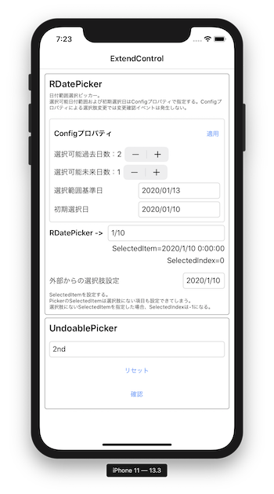

# Picker Extend

## はじめに

Xamarin.FormsのPickerを拡張して2つの特化Pickerを作成した。

1. UndoablePicker<br/>
変更取り消し可能なピッカー。<br/>
変更確認処理を設定でき、選択項目変更時に変更確認処理を呼び出す。変更確認処理がキャンセルを返却したら変更前の選択項目に戻る。

1. RDatePicker<br/>
日付一覧ピッカー。<br/>
UndoablePickerを継承しているので選択肢の変更確認および変更取り消しが可能。

## Screenshot



## UndoablePickerの使い方

BeforeChageTaskプロパティに変更確認処理Taskを設定すると、選択肢を変更した際に変更確認処理Taskをawaitで呼び出す。変更確認処理Taskでfalseを返すと変更前の選択肢に戻す。

変更確認処理Taskを呼び出さず強制的に選択肢を変更するには、```SelectIndexForce(int index)```もしくは```SelectItemForce(object target)```で選択肢を設定する。

## RDatePickerの使い方

Configプロパティで選択可能な日付範囲、初期選択日付を設定する。
UndoablePickerを継承しているので、変更確認処理を設定可能。
